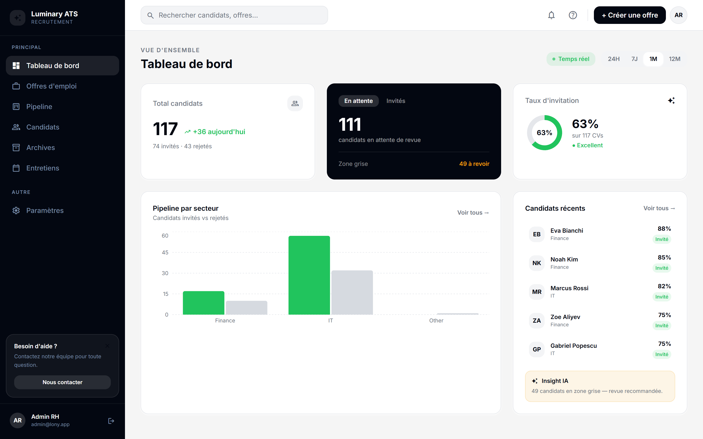
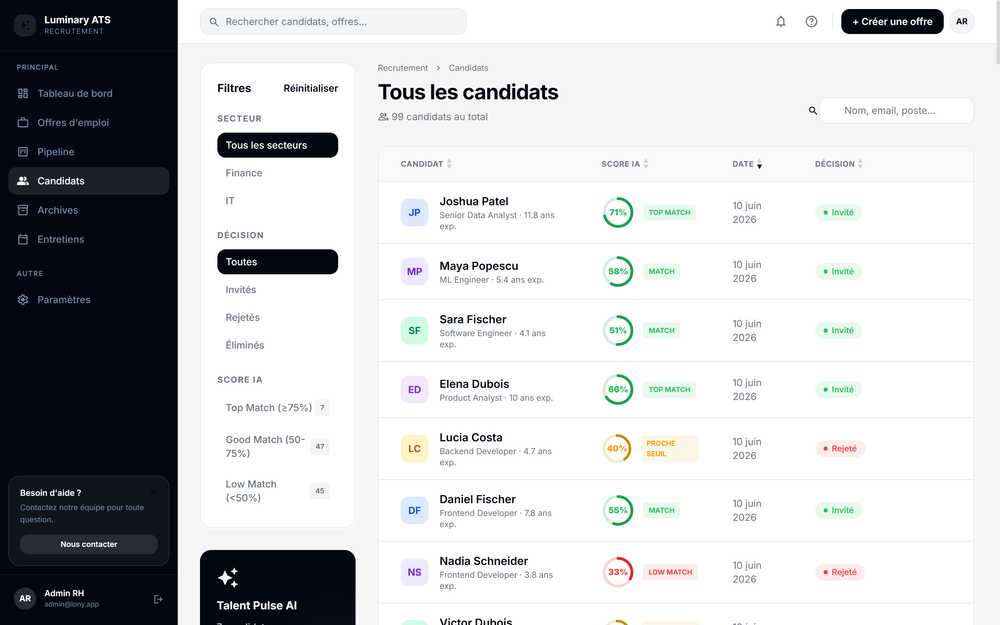
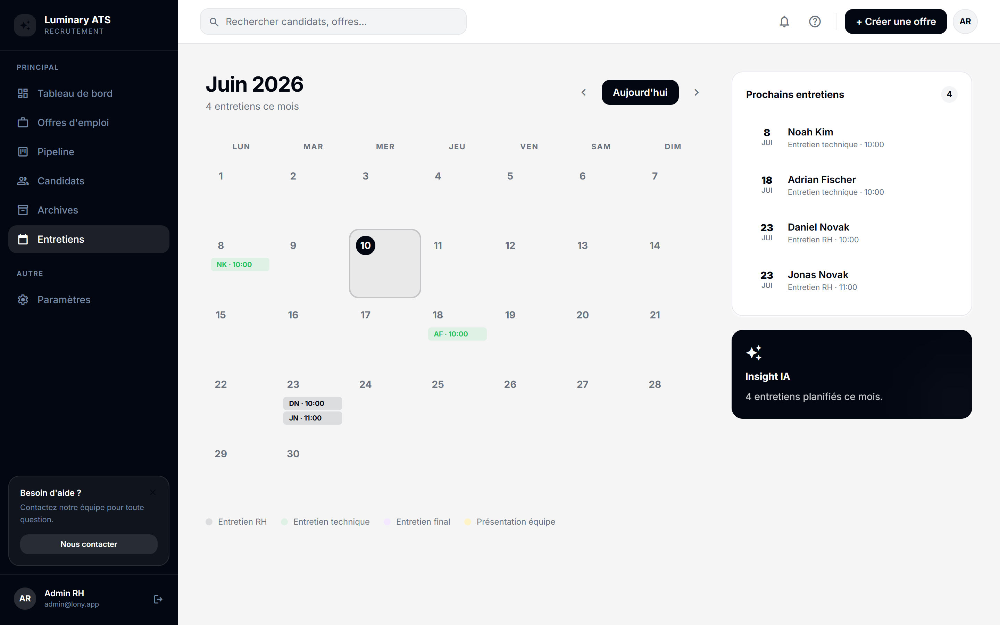

# CV-Intelligence

Système de tri automatisé de CVs par IA pour TechCore Liège (contexte fictif).
Conformité RGPD et EU AI Act (haut risque, Annexe III).

**Auteurs :** Tom Perez Le Tiec, Arnaud Leroy

---

## Démo en ligne

| Service | URL |
|---|---|
| 🎨 Dashboard RH (ATS) | https://ats.lony.app |
| ⚙️ API (Swagger) | https://api.lony.app/docs |
| 🔄 Workflows n8n | https://n8n.lony.app |

---

## Captures d'écran

| Tableau de bord | Liste des candidats | Calendrier des entretiens |
|---|---|---|
|  |  |  |

---

## Architecture

```
Email CV (testmail.app)
    │
    ▼
n8n (cron toutes les 2 min) ──────────────► n8n.lony.app
    │  télécharge la pièce jointe (pdf/docx/txt)
    ▼
FastAPI  POST /score  ─────────────────────► api.lony.app
    │  p01_parse (regex/LLM Groq) → features → modèle v7 (LogisticRegression)
    │  → score + décision + explications SHAP
    ▼
PostgreSQL (candidats, jobs, scorecards, commentaires, entretiens)
    │
    ▼
SSE /events ──► Dashboard RH React (Kanban, profils, stats, biais) ──► ats.lony.app
    │
    ▼
Email auto (invite / reject) via testmail.app
```

### Stack

| Couche | Techno |
|---|---|
| Pipeline ML | Python 3.11, scikit-learn, pandas, SHAP, Groq (LLM parsing) |
| MLOps | MLflow (tracking local dans `mlruns/`) |
| API | FastAPI + SQLAlchemy + PostgreSQL |
| Frontend | React 19, Vite, Tailwind CSS, dnd-kit, recharts |
| Ingestion | n8n |
| Déploiement | Docker Compose (DB + API + n8n) sur Digital Ocean, frontend sur Vercel |

---

## Structure du projet

```
pipeline_ml/
  core/
    p00_exploration.py  # Exploration des données brutes (data/raw/)
    p01_parse.py        # Parsing CV — regex (.txt) + LLM Groq (.pdf/.docx/.txt)
    p02_features.py     # Feature engineering (9 features composites)
    p03_analysis.py     # EDA (outliers, VIF, mutual information)
    p04_train.py        # Entraînement LR + Grid Search + seuils + MLflow
    p05_label_audit.py  # Audit statistique des biais dans les labels
    p06_audit.py        # Audit biais SHAP + fairness + MLflow tracking
    p07_labeling.py      # Outil de labellisation manuelle
  tests/
    test_pipeline.py     # Tests d'intégration (imports, MLflow, Groq, regex)
  run.py                  # Menu interactif (pipeline complet ou étape par étape)
  requirements_ml.txt

api/
  main.py                 # FastAPI — point d'entrée
  scoring.py              # Chargement modèle, scoring, SHAP
  routers/                # auth, candidates, jobs, interviews, comments, scorecards, stats, pipeline
  requirements_api.txt

frontend/                 # Dashboard RH (React + Vite + Tailwind)
  src/pages/              # Dashboard, Pipeline (Kanban), CandidateList, CandidateProfile, Jobs, Calendar, Archives, Settings
  src/tabs/                # Onglets candidat : Overview, Analyse, Performance, Inbox

data/                      # Ignoré par git (RGPD)
  raw/                     # CVs bruts .txt / .pdf / .docx
  processed/               # features.csv (anonymisé) + identities.csv (sensible)

models/                    # Artefacts ignorés par git, historique versionné
  model.pkl, scaler.pkl, feature_cols.pkl, threshold.pkl, threshold_junior.pkl
  HISTORY.md               # Historique des versions du modèle (v1 → v7)

reports/
  RAPPORT_FINAL_ML.md      # Rapport de synthèse du modèle (architecture, métriques, fairness)
  generate_final_plots.py  # Régénère les graphiques ci-dessous depuis le modèle déployé
  plots/                   # Matrices de confusion, ROC, SHAP, équité (genre/âge/pays)

docs/
  audit/                   # Audit comparatif v6→v7, documentation technique AI Act
  presentation/            # Supports de présentation (pipeline, biais)
  project/                 # Roadmap MLOps/OCR
  recherches/              # Documents de cadrage (sujet, grilles de critères)
  Cours/                   # Supports de cours (Work Package 2)
  n8n/                      # Export du workflow n8n

mlruns/, mlflow.db          # Tracking MLflow (ignoré par git)
docker-compose.yml, Dockerfile
```

---

## Prérequis

- Python 3.11+
- Node.js 20+ (frontend)
- Docker + Docker Compose (déploiement complet : API + PostgreSQL + n8n)
- Une clé [Groq](https://console.groq.com/keys) pour le parsing LLM (PDF/DOCX)

```bash
# Pipeline ML
pip install -r pipeline_ml/requirements_ml.txt

# API
pip install -r api/requirements_api.txt

# Frontend
cd frontend && npm install
```

Copier `.env.example` vers `.env` et renseigner `GROQ_API_KEY`, `TESTMAIL_API_KEY`,
`SECRET_KEY` (voir `.env.example` pour le détail).

---

## Lancer le pipeline ML

### Menu interactif

```bash
python pipeline_ml/run.py
```

```
[0] Exploration des données brutes
[1] Parsing CV (Raw → features.csv + identities.csv)
[2] Feature Engineering v2
[3] EDA & Analyse Statistique
[4] Entraînement Fairness-Aware (Grid Search + seuils)
[6] Audit Biais, Équité & SHAP
[9] Pipeline COMPLET (0 → 6)
```

### Étapes individuelles

```bash
python -m pipeline_ml.core.p01_parse              # parsing regex (rapide, .txt)
python -m pipeline_ml.core.p01_parse --parser llm # parsing Groq (.pdf/.docx)
python -m pipeline_ml.core.p04_train              # entraînement + MLflow
python -m pipeline_ml.core.p06_audit              # audit biais + SHAP + MLflow

mlflow ui   # → http://localhost:5000
```

> `identities.csv` (données sensibles : nom, email, téléphone, genre, âge, ville, pays)
> n'est **jamais** passé au modèle — seul `features.csv` (anonymisé) sert à
> l'entraînement. Les deux fichiers se joignent uniquement via `cv_id`.

### Tests

```bash
pytest pipeline_ml/tests/test_pipeline.py -v
```

---

## Lancer l'API et le frontend

```bash
# API (avec PostgreSQL + n8n via Docker)
docker compose up -d
# ou en local
uvicorn api.main:app --reload --port 8000

# Frontend
cd frontend
npm run dev   # → http://localhost:5173 (proxy Vite vers :8000)
```

---

## Le modèle (v7) — résumé

Régression logistique (`C=0.01`, L2, `class_weight='balanced'`, optimisée par Grid
Search 5-fold sur AUC-ROC), 9 features anonymisées, **AUC-ROC = 0.837** (test set).

Deux seuils de décision pour corriger un biais d'âge confirmé dans les labels
historiques (p<0.0001) :
- **Adultes (30+) : 0.460** — seuil F1-optimal
- **Juniors (<30) : 0.326** — calculé par **parité démographique** (Feldman et al.,
  2015), recalculé automatiquement à chaque ré-entraînement

Résultats clés (test set) :

| Métrique | Valeur |
|---|---|
| AUC-ROC | 0.837 |
| Recall global (Invités) | 0.90 |
| Recall Femmes / Hommes | 0.909 / 0.839 |
| Recall Adultes / Juniors | 0.878 / 0.833 |

Détails complets, graphiques et limites : [`reports/RAPPORT_FINAL_ML.md`](reports/RAPPORT_FINAL_ML.md).

---

## Conformité RGPD & EU AI Act

Le recrutement est classé **usage à haut risque** (AI Act, Annexe III) :

- Décision finale toujours humaine — le modèle produit un **score**, pas une décision
- Aucun rejet définitif sans révision humaine tracée (Art. 14)
- Données sensibles (`gender`, `age`, `country`...) exclues du modèle — utilisées
  uniquement pour le monitoring de biais (`identities.csv`, jamais transmis au modèle)
- Explicabilité **SHAP** par candidat (`api/scoring.py`, `LinearExplainer` exact car
  modèle linéaire)
- Audit de biais (genre, âge, pays) à chaque ré-entraînement, tracé dans MLflow
- Aucune feature démographique directe dans le modèle

Détail complet : [`docs/audit/documentation_technique_ai_act.md`](docs/audit/documentation_technique_ai_act.md).

---

## Documentation

| Document | Contenu |
|---|---|
| [`CLAUDE.md`](CLAUDE.md) | Référence technique : structure, conventions, commandes de dev |
| [`reports/RAPPORT_FINAL_ML.md`](reports/RAPPORT_FINAL_ML.md) | Rapport de synthèse du modèle ML (architecture, features, métriques, fairness, limites) |
| [`models/HISTORY.md`](models/HISTORY.md) | Historique des versions du modèle (v1 → v7) |
| [`docs/audit/audit_comparatif_v6_v7.md`](docs/audit/audit_comparatif_v6_v7.md) | Audit comparatif détaillé v6→v7 : biais genre/âge/pays, justification de la parité démographique |
| [`docs/audit/documentation_technique_ai_act.md`](docs/audit/documentation_technique_ai_act.md) | Documentation de conformité EU AI Act (architecture, classification, explicabilité, gestion des risques) |
| [`docs/audit/WP2_Rapport_Audit_Equite.docx`](docs/audit/WP2_Rapport_Audit_Equite.docx) | Rapport d'audit d'équité (Work Package 2) |
| [`docs/project/mlops_and_ocr_roadmap.md`](docs/project/mlops_and_ocr_roadmap.md) | Roadmap MLOps (MLflow, parsing LLM, OCR, DVC) |
| [`docs/presentation/`](docs/presentation/) | Supports de présentation (vue d'ensemble pipeline, présentation des biais) |
| [`docs/recherches/`](docs/recherches/) | Documents de cadrage du projet (sujet, grilles de critères, dashboard) |
| [`docs/n8n/Automatic CV.json`](docs/n8n/Automatic%20CV.json) | Export du workflow d'ingestion n8n |

> Un mémo de reconnexion au serveur de déploiement (`RECONNEXION.md`) existe en local
> mais n'est pas versionné (dépôt public — détails d'infrastructure non exposés).
