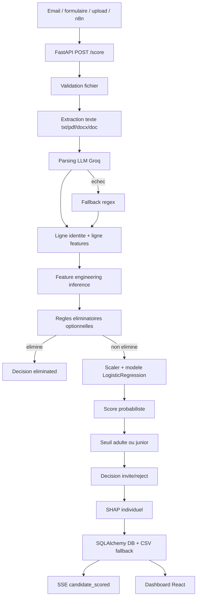

# Documentation technique complete AI Act - CV-Intelligence

Version: 2.0  
Date: 11 mai 2026  
Projet: `Automatic_CV / CV-Intelligence`  
Perimetre: backend FastAPI, pipeline ML, dashboard React, orchestration n8n, base SQL, exigences AI Act  
Statut: documentation technique projet. Ne remplace pas une validation juridique, DPO ou organisme notifie.

## 1. Resume executif

CV-Intelligence est une application d'aide au tri de CV pour equipes RH. Le systeme ingere un CV, extrait le texte, construit des variables decrivant le parcours du candidat, applique un modele de scoring et restitue une recommandation de priorisation au recruteur. Le systeme expose aussi un dashboard, des explications SHAP, des statistiques, une gestion d'offres, des commentaires et des entretiens.

Le cas d'usage touche au recrutement. Il doit donc etre traite comme systeme d'IA a haut risque au sens de l'AI Act lorsque ses sorties servent a filtrer, classer, recommander ou evaluer des candidats. L'architecture actuelle doit etre exploitee comme aide a la decision uniquement: aucune decision finale ne doit etre prise automatiquement.

Sources de reference:

- Reglement (UE) 2024/1689, texte officiel EUR-Lex: https://eur-lex.europa.eu/eli/reg/2024/1689/oj
- Article 11, documentation technique: https://ai-act-service-desk.ec.europa.eu/en/ai-act/article-11

## 2. Identification du systeme

| Champ | Valeur |
|---|---|
| Nom produit | CV-Intelligence |
| Nom depot | Automatic_CV |
| Version API | 2.1.0, definie dans `api/main.py` |
| Domaine | Recrutement, tri et analyse de CV |
| Utilisateurs | Administrateurs RH, recruteurs |
| Personnes affectees | Candidats a un poste |
| Environnement | Python 3.11, FastAPI, React/Vite, PostgreSQL ou SQLite, n8n |
| Modele ML principal | Regression logistique scikit-learn |
| Sorties IA | Score, decision indicative, seuil utilise, rang de priorite, explications SHAP |
| Niveau de risque | Haut risque par usage emploi/recrutement |
| Principe d'exploitation | Supervision humaine obligatoire |

## 3. Arborescence technique

```text
Automatic_CV/
  api/
    main.py                  # Point d'entree FastAPI, CORS, /score, SSE, routers
    auth.py                  # JWT, bcrypt, dependances FastAPI
    config.py                # Chemins, constantes, champs CSV, labels SHAP
    database.py              # SQLAlchemy, modeles Candidate/Job/User/Interview
    scoring.py               # Chargement modele, scoring, SHAP, sauvegarde
    sse.py                   # Broadcast Server-Sent Events
    routers/
      auth.py                # Login et gestion utilisateurs
      candidates.py          # CRUD candidats, detail, statut, explain
      jobs.py                # CRUD offres d'emploi
      stats.py               # KPI, analyse periode, spot-check
      comments.py            # Commentaires RH par candidat
      interviews.py          # CRUD entretiens
  pipeline_ml/
    run.py                   # Lanceur pipeline
    core/
      p00_exploration.py     # Exploration donnees brutes
      p01_parse.py           # Extraction texte et parsing CV
      p02_features.py        # Feature engineering batch
      p03_analysis.py        # Analyse statistique
      p04_train.py           # Entrainement modele
      p05_label_audit.py     # Audit labels
      p06_audit.py           # Audit biais, equite, SHAP
  frontend/
    src/
      App.jsx                # Router applicatif client
      lib/api.js             # Client HTTP centralise
      contexts/AuthContext.jsx
      pages/                 # Dashboard, candidats, jobs, settings, archives, calendar
      components/            # UI, modales, detail candidat, navigation
  config/
    eliminatory_criteria.json
  docs/
    documentation_technique_ai_act.md
    n8n/Automatic CV.json
    recherches/
  data/
    raw/                     # CV sources, labels
    processed/               # CSV features, identities, candidats live, raw_texts
  models/                    # Artefacts modele generes
  Dockerfile
  docker-compose.yml
```

## 4. Classification AI Act

### 4.1 Systeme d'IA

Le systeme repond a la definition fonctionnelle d'un systeme d'IA car il produit des sorties predictives a partir d'entrees candidates, au moyen d'un modele d'apprentissage automatique et d'un pipeline de transformation de donnees.

### 4.2 Usage haut risque

Le systeme est utilise dans le recrutement. Il peut influencer l'acces a l'emploi par classement, priorisation ou recommandation de rejet. Il doit donc etre traite comme systeme d'IA a haut risque.

### 4.3 Finalite prevue

Finalite prevue:

- aider les recruteurs a prioriser la revue des CV;
- fournir des signaux explicables sur l'adequation d'un profil;
- identifier les profils proches du seuil pour revue;
- produire des statistiques d'aide au pilotage RH.

Finalites exclues:

- decision automatique definitive;
- rejet sans revue humaine;
- evaluation de personnalite;
- detection d'emotions;
- inference de caracteristiques sensibles;
- surveillance ou notation sociale.

## 5. Architecture logique



## 6. Architecture de deploiement

### 6.1 Services Docker Compose

| Service | Image / build | Port | Role |
|---|---|---|---|
| `db` | `postgres:16-alpine` | `5432` | Base PostgreSQL |
| `api` | build local `Dockerfile` | `8000` | API FastAPI |
| `n8n` | `docker.n8n.io/n8nio/n8n` | `5678` | Orchestration ingestion |

Volumes:

- `pg_data`: donnees PostgreSQL.
- `n8n_data`: configuration et executions n8n.
- `./data:/app/data`: donnees CV et CSV.
- `./models:/app/models`: artefacts ML.

### 6.2 Dockerfile API

L'image API:

1. part de `python:3.11-slim`;
2. installe les dependances `api/requirements_api.txt` et `pipeline_ml/requirements_ml.txt`;
3. copie `api/` et `pipeline_ml/`;
4. expose le port 8000;
5. lance `uvicorn api.main:app --host 0.0.0.0 --port 8000`.

### 6.3 Environnements supportes

| Environnement | Base | Usage |
|---|---|---|
| Developpement local sans Docker | SQLite `sqlite:///./data/cv_intelligence.db` | Test rapide API |
| Developpement Docker | PostgreSQL Compose | Reproduction proche production |
| Production | PostgreSQL gere ou container durci | Usage client |

## 7. Variables d'environnement

| Variable | Obligatoire | Utilisation | Risque si absente |
|---|---|---|---|
| `DATABASE_URL` | Non en dev, oui prod | Connexion DB SQLAlchemy | Fallback SQLite local |
| `JWT_SECRET` | Oui prod | Signature JWT | Secret par defaut dangereux |
| `JWT_EXPIRE_HOURS` | Non | Duree token | 24 h par defaut |
| `ADMIN_EMAIL` | Oui prod | Seed admin | `admin@lony.app` par defaut |
| `ADMIN_PASSWORD` | Oui prod | Mot de passe seed | Mot de passe par defaut dangereux |
| `ADMIN_NAME` | Non | Nom admin seed | `Admin RH` |
| `GROQ_API_KEY` | Non | Parsing LLM | Fallback regex |
| `POSTGRES_DB` | Docker | Nom DB | `cv_intelligence` |
| `POSTGRES_USER` | Docker | User DB | `cv_user` |
| `POSTGRES_PASSWORD` | Docker | Mot de passe DB | `cv_pass` par defaut dangereux |
| `N8N_HOST` | Prod n8n | Host n8n | localhost par defaut |
| `WEBHOOK_URL` | Prod n8n | URL webhook | localhost par defaut |
| `VITE_API_URL` | Front prod | URL API frontend | Proxy local si vide |

Exigence production: l'application doit refuser de demarrer si `JWT_SECRET`, `ADMIN_PASSWORD` ou `POSTGRES_PASSWORD` utilisent les valeurs par defaut.

## 8. Backend FastAPI

### 8.1 Initialisation

Au demarrage, `api/main.py` execute:

- creation application FastAPI;
- configuration CORS;
- inclusion des routers;
- `init_db()` pour creer les tables;
- `_seed_admin()` si aucun utilisateur n'existe.

### 8.2 CORS

Origines autorisees:

- `http://localhost:5173`
- `https://ats.lony.app`
- `https://n8n.lony.app`

Methodes:

- `GET`
- `POST`
- `PATCH`
- `DELETE`

Point technique: en production multi-environnements, cette liste doit etre externalisee dans `.env`.

### 8.3 Endpoints publics

| Methode | Route | Fonction | Commentaire securite |
|---|---|---|---|
| GET | `/` | Health/status API | Acceptable public |
| GET | `/events` | SSE temps reel | Public car EventSource sans header custom |
| POST | `/score` | Upload et scoring CV | A proteger avant production |
| POST | `/api/v1/candidates` | Endpoint legacy n8n | A proteger par secret n8n |
| POST | `/auth/login` | Connexion | Public necessaire |

### 8.4 Endpoints proteges JWT

| Methode | Route | Role |
|---|---|---|
| GET | `/auth/me` | Retourne le payload token |
| GET | `/auth/users` | Liste utilisateurs, admin seulement |
| POST | `/auth/users` | Cree utilisateur, admin seulement |
| PATCH | `/auth/users/{user_id}` | Admin ou soi-meme |
| DELETE | `/auth/users/{user_id}` | Desactivation, admin seulement |
| GET | `/candidates` | Liste candidats |
| GET | `/candidates/{candidate_id}` | Detail candidat |
| PATCH | `/candidates/{candidate_id}/status` | Mise a jour statut |
| DELETE | `/candidates/{candidate_id}` | Suppression candidat |
| GET | `/candidates/{candidate_id}/explain` | Explication individuelle |
| GET | `/comments/{candidate_id}` | Commentaires |
| POST | `/comments/{candidate_id}` | Ajout commentaire |
| PATCH | `/comments/{candidate_id}/{comment_id}` | Modification commentaire |
| DELETE | `/comments/{candidate_id}/{comment_id}` | Suppression commentaire |
| GET | `/jobs` | Liste offres |
| POST | `/jobs` | Creation offre |
| PATCH | `/jobs/{job_id}` | Modification offre |
| DELETE | `/jobs/{job_id}` | Suppression offre |
| GET | `/stats` | KPI dashboard |
| GET | `/analyse/period` | Analyse periode |
| GET | `/analyse/spotcheck` | Echantillon rejets |
| GET | `/interviews` | Liste entretiens |
| POST | `/interviews` | Creation entretien |
| PATCH | `/interviews/{interview_id}` | Modification entretien |
| DELETE | `/interviews/{interview_id}` | Suppression entretien |

## 9. Contrats API principaux

### 9.1 `POST /score`

Type: multipart form-data  
Champ requis: `file`

Formats acceptes par le code:

- `.txt`
- `.pdf`
- `.docx`
- `.doc`

Reponse nominale:

```json
{
  "candidate_id": "uuid",
  "name": "Nom candidat",
  "email": "email@example.com",
  "score": 0.7342,
  "priority_rank": 82,
  "decision": "invite",
  "eliminated_reason": null,
  "threshold_used": 0.463,
  "sector": "IT",
  "years_experience": 5.2,
  "status": "inbox",
  "received_at": "2026-05-11T10:30:00"
}
```

Codes d'erreur:

- `503`: modele non disponible;
- `422`: texte non extractible, notamment PDF graphique sans couche texte;
- erreurs non gerees possibles si parsing ou sauvegarde echoue.

### 9.2 `GET /candidates`

Parametres:

- `decision`: `invite`, `reject`, `eliminated`, `no_model`;
- `sector`: secteur exact ou filtre SQL `ilike`;
- `status`: `inbox`, `review`, `interview`, `rejected`, `archived`, `interview_scheduled`;
- `min_score`: float, defaut `0.0`;
- `limit`: int, defaut `200`;
- `q`: recherche nom, email, role, secteur.

Tri: score descendant.  
Source: base SQL prioritaire, CSV fallback.

### 9.3 `PATCH /candidates/{candidate_id}/status`

Payload:

```json
{
  "status": "review"
}
```

Statuts valides:

- `inbox`
- `review`
- `interview`
- `rejected`
- `archived`
- `interview_scheduled`

Effet: met a jour la base, le CSV si present, puis diffuse un evenement SSE `status_updated`.

### 9.4 `GET /candidates/{candidate_id}/explain`

Reponse:

```json
{
  "shap": {
    "Exp/age normalise": 0.118,
    "Niveau etudes": -0.044
  },
  "narrative": "Score de 73% - profil invite. Points forts : ...",
  "missing": [
    {
      "feature": "Potentiel junior",
      "candidate_value": 0.2,
      "invited_avg": 0.5,
      "gap_pct": 60.0
    }
  ]
}
```

Limite actuelle: lit uniquement `CANDIDATES_FILE`, donc l'explication peut echouer si le candidat n'est present qu'en base SQL.

### 9.5 Authentification

`POST /auth/login`

Payload:

```json
{
  "email": "admin@example.com",
  "password": "secret"
}
```

Reponse:

```json
{
  "access_token": "jwt",
  "token_type": "bearer",
  "user": {
    "user_id": "id",
    "email": "admin@example.com",
    "name": "Admin RH",
    "role": "admin",
    "is_active": true,
    "created_at": "..."
  }
}
```

## 10. Modele de donnees SQL

### 10.1 Table `candidates`

| Colonne | Type | Role |
|---|---|---|
| `candidate_id` | String(64), PK | Identifiant candidat |
| `received_at` | DateTime, index | Date reception |
| `source_filename` | String(255) | Fichier source |
| `name` | String(255) | Nom |
| `email` | String(255) | Email |
| `phone` | String(64) | Telephone |
| `gender` | String(16) | Genre, audit uniquement |
| `age` | Integer | Age, audit/seuil junior |
| `sector` | String(128) | Secteur |
| `target_role` | String(255) | Role cible |
| `years_experience` | Float | Annees experience |
| `education_level` | Float | Niveau formation |
| `score` | Float, index | Probabilite modele |
| `decision` | String(32), index | Decision indicative |
| `threshold_used` | Float | Seuil applique |
| `priority_rank` | Integer | Rang percentile |
| `eliminated_reason` | String(512) | Raison eliminatoire |
| `shap_json` | Text | Explications SHAP |
| `status` | String(32), index | Workflow RH |

Index compose:

- `ix_candidates_decision_score(decision, score)`

### 10.2 Table `jobs`

| Colonne | Type | Role |
|---|---|---|
| `job_id` | String(64), PK | Identifiant offre |
| `title` | String(255) | Intitule |
| `department` | String(128) | Departement |
| `location` | String(255) | Lieu |
| `description` | Text | Description |
| `status` | String(32), index | `active`, `draft`, `closed`, `paused` |
| `stage` | String(32) | Etape recrutement |
| `priority` | String(32) | Priorite |
| `applicants_count` | Integer | Compteur denormalise |
| `avg_score` | Float | Score moyen |
| `created_at` | DateTime, index | Creation |
| `updated_at` | DateTime | Modification |

### 10.3 Table `users`

| Colonne | Type | Role |
|---|---|---|
| `user_id` | String(64), PK | Identifiant utilisateur |
| `email` | String(255), unique, index | Login |
| `name` | String(255) | Nom |
| `password_hash` | String(255) | Hash bcrypt |
| `role` | String(32) | `admin` ou `recruiter` |
| `is_active` | Boolean | Compte actif |
| `created_at` | DateTime | Creation |

### 10.4 Table `interviews`

| Colonne | Type | Role |
|---|---|---|
| `interview_id` | String(64), PK | Identifiant entretien |
| `candidate_id` | String(64), index | Candidat |
| `candidate_name` | String(255) | Nom denormalise |
| `date` | String(16), index | Date YYYY-MM-DD |
| `time` | String(8) | Heure HH:MM |
| `interview_type` | String(128) | Type entretien |
| `notes` | Text | Notes |
| `created_at` | DateTime | Creation |
| `updated_at` | DateTime | Modification |

## 11. Stockages fichiers

| Chemin | Contenu | Sensibilite |
|---|---|---|
| `data/raw/` | CV bruts, labels | Tres sensible |
| `data/processed/features.csv` | Features modele | Sensible faible a moyen |
| `data/processed/identities.csv` | Identite, age, genre, telephone | Tres sensible |
| `data/processed/candidates_live.csv` | Candidats live, score, decision | Tres sensible |
| `data/processed/comments.json` | Commentaires RH | Tres sensible |
| `data/processed/raw_texts/` | Texte CV extrait | Tres sensible |
| `models/model.pkl` | Modele | Critique |
| `models/scaler.pkl` | Scaler | Critique |
| `models/feature_cols.pkl` | Liste features | Critique |
| `models/threshold.pkl` | Seuil adulte | Critique |
| `models/threshold_junior.pkl` | Seuil junior | Critique |
| `models/mlflow_run_id.txt` | Trace run | Moyen |

Exigence production: ces chemins doivent etre exclus de Git, sauvegardes chiffrees, acces restreints, retention limitee.

## 12. Pipeline ML

### 12.1 Etapes

| Etape | Module | Entree | Sortie |
|---|---|---|---|
| 00 | `p00_exploration.py` | `data/raw/` | Statistiques exploratoires |
| 01 | `p01_parse.py` | CV bruts, labels | `features.csv`, `identities.csv` |
| 02 | `p02_features.py` | `features.csv` | Features enrichies |
| 03 | `p03_analysis.py` | Features | Analyses statistiques |
| 04 | `p04_train.py` | Features + identities | Artefacts modele |
| 06 | `p06_audit.py` | Artefacts + donnees | Rapport audit + MLflow |

### 12.2 Commandes

Menu interactif:

```bash
python pipeline_ml/run.py
```

Pipeline complet via fonction `run_full()`:

```bash
python -c "from pipeline_ml.run import run_full; run_full()"
```

Note: le fichier `run.py` actuel lance le menu par defaut. Pour une CLI production, ajouter un parsing d'arguments explicite.

### 12.3 Parsing CV

Formats:

- `.txt`: lecture UTF-8 avec erreurs ignorees;
- `.pdf`: `pdfplumber`;
- `.docx` et `.doc`: `python-docx`;
- PDF graphique: extraction vide et avertissement OCR recommande.

Deux modes:

- batch regex via `parse_cv()`;
- live LLM via `parse_cv_llm()` avec fallback regex.

### 12.4 Feature engineering inference

`api/scoring.py` reconstruit les features necessaires en live:

- `log_years_exp`
- `log_avg_job_duration`
- `has_multiple_languages`
- `potential_score`
- `junior_potential`
- `cert_density`
- `multilingual_score`
- `method_tech_ratio`
- `tech_per_year`
- `career_depth`
- `is_it`
- `is_finance`
- `exp_per_year_of_age`
- `field_match`
- `education_adj`

Risque technique: le feature engineering batch et live doivent rester strictement synchronises. Toute divergence peut fausser les scores.

### 12.5 Entrainement

Modele:

- `LogisticRegression(max_iter=1000, random_state=42)`
- `StandardScaler`
- `GridSearchCV`
- scoring `roc_auc`
- `StratifiedKFold`

Hyperparametres explores:

```python
{
  "C": [0.01, 0.05, 0.1, 0.5, 1.0, 5.0],
  "l1_ratio": [0.0, 0.5, 1.0],
  "solver": ["saga"],
  "class_weight": ["balanced"]
}
```

Features modele:

```text
exp_per_year_of_age
avg_job_duration
education_adj
potential_score
junior_potential
has_multiple_languages
career_depth
is_it
field_match
```

### 12.6 Seuils

Deux seuils sont sauvegardes:

- `threshold.pkl`: seuil adulte, optimise F1;
- `threshold_junior.pkl`: seuil junior, optimise avec objectif de recall.

En inference:

```text
si age < 30 -> seuil junior
sinon       -> seuil adulte
```

Justification: limiter un biais structurel contre les profils juniors. Cette logique doit etre surveillee car elle utilise l'age comme variable de traitement, meme si l'age n'est pas une feature directe du modele.

### 12.7 Artefacts MLflow

L'entrainement journalise:

- meilleurs hyperparametres;
- seuil adulte et seuil junior;
- nombre de features;
- tailles train/test;
- AUC-ROC CV;
- AUC-ROC test;
- F1 test;
- rapport d'evaluation;
- modele sklearn.

L'audit journalise:

- recall et precision par genre;
- recall par groupe d'age;
- ecart de recall homme/femme;
- importance SHAP par feature;
- rapport texte.

## 13. Regles eliminatoires

Configuration: `config/eliminatory_criteria.json`

Structure:

```json
{
  "version": "1.0",
  "rules": [
    {
      "id": "min_education",
      "field": "education_level",
      "operator": "gte",
      "value": 1,
      "enabled": false,
      "reason": "Niveau d'etudes insuffisant pour le poste"
    }
  ]
}
```

Operateurs supportes dans le code:

- `gte`: verifie que la valeur candidat est superieure ou egale;
- `in`: verifie l'appartenance a une liste.

Regles configurees:

- niveau d'etudes minimum;
- secteurs acceptes;
- annees d'experience minimum;
- langues minimum.

Point AI Act: toute regle eliminatoire active doit faire l'objet d'une validation humaine et juridique. Une decision `eliminated` doit etre revue avant rejet final.

## 14. Explicabilite

### 14.1 SHAP individuel

Dans `score_features()`, le systeme tente:

```text
shap.LinearExplainer(model, X_s, feature_perturbation="interventional")
```

La sortie est stockee en JSON:

```json
{
  "exp_per_year_of_age": 0.1234,
  "education_adj": -0.0876
}
```

### 14.2 Narratif

`shap_narrative()` produit:

- score arrondi en pourcentage;
- statut invite/rejete selon seuil;
- jusqu'a 3 points forts;
- jusqu'a 2 freins.

### 14.3 Limites

SHAP explique le comportement du modele, pas la valeur professionnelle objective du candidat. Une explication SHAP ne doit pas etre communiquee comme justification unique d'un rejet.

## 15. Frontend React

### 15.1 Navigation

`App.jsx` utilise un routage client simple:

| URL | Page |
|---|---|
| `/` | Dashboard |
| `/dashboard` | Dashboard |
| `/jobs` | Jobs |
| `/candidates` | CandidateList |
| `/calendar` | Calendar |
| `/settings` | Settings |
| `/archives` | Archives |

`profile` est un etat interne qui revient visuellement a `/candidates`.

### 15.2 Client HTTP

`frontend/src/lib/api.js` centralise:

- base URL via `VITE_API_URL`;
- token JWT dans `localStorage` sous `lony_token`;
- ajout header `Authorization: Bearer`;
- deconnexion automatique si `401`;
- wrappers API candidats, stats, jobs, interviews, commentaires.

Risque: stockage JWT dans `localStorage` expose aux attaques XSS. En production, envisager cookies HttpOnly ou durcissement CSP strict.

### 15.3 Workflows RH

Le frontend couvre:

- authentification;
- consultation dashboard;
- liste et detail candidat;
- changement de statut;
- gestion jobs;
- calendrier entretiens;
- archives;
- settings;
- commentaires.

## 16. n8n

Le workflow n8n est stocke dans `docs/n8n/Automatic CV.json`. Son role attendu:

- detecter une entree candidat;
- extraire ou transmettre le fichier;
- appeler l'API `/score` ou `/api/v1/candidates`;
- notifier ou stocker le resultat;
- alimenter le dashboard via la base ou l'API.

Exigence production:

- chaque appel n8n vers l'API doit etre authentifie;
- le webhook doit etre protege par secret;
- les executions n8n doivent etre purgees ou chiffrees car elles peuvent contenir des CV.

## 17. Securite applicative

### 17.1 Mesures existantes

- Hash des mots de passe via bcrypt.
- JWT signe en HS256.
- Roles `admin` et `recruiter`.
- Desactivation utilisateur sans suppression physique.
- Routes metier majoritairement protegees par dependance `get_current_user`.
- CORS limite a quelques origines.

### 17.2 Ecarts critiques

| Ecart | Gravite | Correction |
|---|---|---|
| `/score` public | Haute | Ajouter JWT, cle API ou secret n8n |
| `/api/v1/candidates` public | Haute | Ajouter verification `N8N_WEBHOOK_SECRET` |
| `JWT_SECRET` par defaut | Haute | Refus demarrage si valeur dev |
| `ADMIN_PASSWORD` par defaut | Haute | Refus demarrage si valeur dev |
| PostgreSQL expose sur `5432` | Moyenne/haute | Restreindre reseau en prod |
| JWT en localStorage | Moyenne | CSP, nettoyage XSS, cookie HttpOnly |
| Pas de rate limiting | Moyenne | Ajouter middleware ou reverse proxy |
| Pas de limite taille upload | Moyenne | Ajouter validation taille/type |

### 17.3 Durcissement recommande

- Reverse proxy HTTPS obligatoire.
- Headers de securite: CSP, HSTS, X-Content-Type-Options.
- Validation MIME et extension fichier.
- Antivirus ou sandbox upload.
- Rate limit par IP et par compte.
- Journalisation des acces aux donnees candidates.
- Rotation des secrets.
- Sauvegardes chiffrees.

## 18. Protection des donnees et RGPD

### 18.1 Categories de donnees

| Categorie | Exemples | Sensibilite |
|---|---|---|
| Identite | nom, email, telephone | Haute |
| Parcours | experience, formation, competences | Haute |
| Donnees derivees | score, decision, rang, SHAP | Haute |
| Attributs proteges | age, genre | Tres haute |
| Donnees RH internes | commentaires, statuts, notes entretien | Tres haute |

### 18.2 Principes techniques

| Principe | Etat actuel | Action requise |
|---|---|---|
| Minimisation | Partielle | Eviter stockage raw_texts si non necessaire |
| Separation | Batch features/identities | Etendre en base live |
| Conservation | Variables mentionnees | Implementer purge effective |
| Exactitude | Parsing + revue | Signaler incertitude parsing |
| Transparence | Documentable | Notice candidat et recruteur |
| Securite | Partielle | Corriger endpoints publics |
| Droits | Suppression candidat | Ajouter export et rectification |

### 18.3 Retention cible

Politique recommandee:

- CV bruts: conservation courte, selon base juridique RH.
- Texte extrait: suppression apres scoring si non indispensable.
- Features anonymisees: conservation possible pour audit si pseudonymisees.
- Identite: duree RH applicable.
- Logs: conservation securite et audit limitee.
- Commentaires RH: conservation alignee au dossier candidat.

## 19. Gestion des risques AI Act

| Risque | Cause | Detection | Mitigation |
|---|---|---|---|
| Discrimination genre | Labels historiques ou proxies | Recall/precision par genre | Audit, relabellisation, revue humaine |
| Discrimination age | Experience correlee age | Recall par groupe age | Seuil junior, analyse periodicite |
| Discrimination origine | Telephone/pays ou langues | Audit pays/langues | Ne pas utiliser pays comme critere |
| Rejet automatique | Mauvaise exploitation outil | Audit statuts | Blocage workflow avant rejet final |
| Erreur parsing | CV mal structure ou PDF image | Extraction vide, incoherences | OCR, revue manuelle |
| Surconfiance score | UI trop definitive | Analyse usage | Afficher incertitude, obligation revue |
| Derive donnees | Nouveaux profils/postes | Drift features | Monitoring distributions |
| Fuite donnees | Endpoints publics ou fichiers | Logs securite | Auth, chiffrement, moindre privilege |
| Dependances LLM | Donnees envoyees a tiers | Audit appels | Minimisation, contrat fournisseur |

## 20. Supervision humaine

### 20.1 Regles d'exploitation

Le recruteur doit:

- examiner les candidats avant rejet final;
- consulter les explications pour les cas limites;
- documenter les changements de statut;
- pouvoir corriger la recommandation;
- traiter les contestations.

### 20.2 Revue obligatoire

Revue humaine renforcee si:

- `abs(score - threshold_used) <= 0.08`;
- decision `eliminated`;
- donnees manquantes critiques;
- CV parse par fallback regex apres echec LLM;
- SHAP absent;
- groupe candidat sous-represente dans l'audit;
- candidat conteste.

### 20.3 Controle technique recommande

Ajouter une contrainte applicative:

```text
decision modele = reject
ET gap au seuil <= 0.08
=> statut final "rejected" interdit sans justification humaine
```

## 21. Monitoring et journalisation

### 21.1 Journalisation actuelle

Le systeme journalise via logger Python:

- initialisation base;
- creation admin;
- chargement modele;
- erreurs DB/CSV;
- parsing LLM OK ou fallback;
- scoring candidat.

Il stocke aussi:

- score;
- decision;
- threshold;
- SHAP;
- status;
- commentaires;
- entretiens.

### 21.2 Journalisation manquante

Ajouter une table `audit_logs`:

| Colonne | Description |
|---|---|
| `audit_id` | Identifiant |
| `timestamp` | Date action |
| `actor_user_id` | Utilisateur |
| `actor_role` | Role |
| `action` | create/read/update/delete/export/status_change/login |
| `resource_type` | candidate/job/comment/interview/user |
| `resource_id` | Identifiant cible |
| `before_json` | Etat avant |
| `after_json` | Etat apres |
| `reason` | Justification RH |
| `ip_address` | Adresse IP |

### 21.3 Monitoring modele

Metriques a calculer chaque mois ou a chaque reentrainement:

- volume candidats;
- taux invitation/rejet;
- score moyen et distribution;
- taux de donnees manquantes;
- AUC/F1 si labels de retour disponibles;
- recall par genre;
- recall par age;
- ecart de selection par groupe;
- top SHAP global;
- taux de recommandations corrigees par RH.

## 22. Tests et validation

### 22.1 Tests existants

Le depot contient `pipeline_ml/tests/test_pipeline.py`. Les details doivent etre executes et complets avant production.

### 22.2 Plan de tests technique

Backend:

- `POST /score` avec `.txt`, `.pdf`, `.docx`;
- rejet propre d'un PDF non extractible;
- absence modele -> `503`;
- login valide/invalide;
- protection JWT sur routers;
- CRUD candidat/job/interview/comment;
- SSE connecte et recoit evenement.

ML:

- compatibilite features batch/live;
- presence de tous les artefacts;
- prediction deterministe sur fixture;
- seuil junior/adulte;
- SHAP JSON valide;
- audit sans crash si groupe manquant.

Frontend:

- login/logout;
- liste candidats;
- filtres;
- changement statut;
- detail candidat;
- affichage explication;
- gestion jobs;
- calendrier entretiens.

Securite:

- endpoints publics controles;
- upload taille excessive;
- CORS;
- token expire;
- role admin/recruiter.

### 22.3 Criteres de mise en production

| Critere | Statut attendu |
|---|---|
| Tests backend critiques | 100% passants |
| Pipeline ML complet | Execute avec artefacts sauvegardes |
| Audit biais | Rapport genere et valide |
| Secrets prod | Aucun secret par defaut |
| Endpoints ingestion | Authentifies |
| Retention | Job de purge actif |
| Audit logs | Actifs sur actions sensibles |
| Notice utilisateur | Fournie |
| Notice candidat | Fournie |

## 23. Procedure d'exploitation

### 23.1 Demarrage local backend

```bash
cd Automatic_CV
python -m venv .venv
.venv\Scripts\activate
pip install -r api\requirements_api.txt -r pipeline_ml\requirements_ml.txt
uvicorn api.main:app --reload --port 8000
```

### 23.2 Demarrage frontend

```bash
cd Automatic_CV\frontend
npm install
npm run dev
```

### 23.3 Demarrage Docker

```bash
cd Automatic_CV
docker compose up --build
```

### 23.4 Verification sante

```bash
curl http://localhost:8000/
```

Reponse attendue:

```json
{
  "status": "online",
  "model_loaded": true,
  "version": "2.1.0"
}
```

### 23.5 Reentrainement modele

1. Ajouter les CV et labels valides.
2. Executer parsing et features.
3. Executer entrainement.
4. Executer audit.
5. Verifier MLflow.
6. Sauvegarder artefacts.
7. Redemarrer API.
8. Comparer resultats avant/apres.
9. Documenter la version.

## 24. Gestion de configuration et versions

Chaque release doit enregistrer:

- version application;
- hash commit Git;
- version modele;
- run MLflow;
- hash `model.pkl`;
- liste features;
- seuils;
- dataset utilise;
- metriques globales;
- metriques par groupe;
- date validation RH;
- date validation technique;
- changements de configuration eliminatoire.

Format recommande:

```json
{
  "release": "2026.05.11-1",
  "api_version": "2.1.0",
  "git_commit": "...",
  "mlflow_run_id": "...",
  "model_hash": "...",
  "features": ["..."],
  "threshold_adult": 0.463,
  "threshold_junior": 0.321,
  "approved_by": ["tech", "rh", "dpo"]
}
```

## 25. Correspondance AI Act Annexe IV

| Exigence Annexe IV | Section document | Couverture |
|---|---|---|
| Description generale du systeme | 2, 3, 4, 5 | Complete |
| Finalite prevue | 4 | Complete |
| Interactions logiciel/materiel | 5, 6 | Complete |
| Versions logiciel/firmware | 2, 24 | Partielle, a versionner |
| Formes de mise a disposition | 6, 23 | Complete |
| Materiel cible | 6 | Partielle, depend infra |
| Methodes de developpement | 12, 24 | Complete |
| Donnees d'entrainement/validation/test | 12, 18 | Partielle, datasets a documenter |
| Logique du systeme | 5, 12, 13 | Complete |
| Supervision humaine | 20 | Complete |
| Exactitude/robustesse/cybersecurite | 17, 19, 22 | Partielle, controles a implementer |
| Gestion des risques | 19 | Complete comme base |
| Changements post-deploiement | 23, 24 | Complete comme procedure |

## 26. Ecarts de conformite prioritaires

### Priorite 1

- Authentifier `/score` et `/api/v1/candidates`.
- Bloquer secrets par defaut en production.
- Ajouter `audit_logs`.
- Implementer retention/purge.
- Ajouter validation taille/type fichier.
- Ajouter justification obligatoire pour rejet final.

### Priorite 2

- Synchroniser et tester features batch/live.
- Ajouter monitoring drift.
- Ajouter export dossier candidat.
- Ajouter rectification candidat.
- Externaliser CORS.
- Ajouter tests API automatises.

### Priorite 3

- Ajouter hash artefacts.
- Ajouter fiche dataset.
- Ajouter model card.
- Ajouter UI fairness pour RH admin.
- Ajouter documentation runbook incident.

## 27. Notices operationnelles AI Act

### 27.1 Notice recruteur

Le recruteur doit etre informe que:

- le score est une recommandation statistique;
- le rejet final reste humain;
- SHAP explique le modele et non la valeur du candidat;
- les donnees extraites peuvent contenir des erreurs;
- les cas proches du seuil doivent etre revus;
- les criteres proteges ne doivent pas motiver une decision individuelle.

### 27.2 Notice candidat

Le candidat doit etre informe:

- de l'utilisation d'un outil d'aide au tri;
- des categories de donnees traitees;
- de la finalite du traitement;
- de l'existence d'une intervention humaine;
- des droits d'acces, rectification, effacement, opposition et contestation;
- du contact responsable de traitement/DPO.

## 28. Conclusion technique

Le projet possede une base technique solide pour un prototype avance: API structuree, modele interpretable, pipeline ML, audit SHAP/equite, dashboard RH et orchestration n8n. Pour atteindre un niveau exploitable en contexte AI Act haut risque, les principaux travaux restants sont la securisation de l'ingestion, la tracabilite applicative complete, la retention RGPD effective, le blocage des rejets non revus et la formalisation des versions modele/dataset.

La presente documentation doit etre maintenue comme artefact vivant: chaque changement de modele, feature, seuil, source de donnees, workflow RH ou endpoint d'ingestion doit entrainer une mise a jour documentaire et une nouvelle validation.
