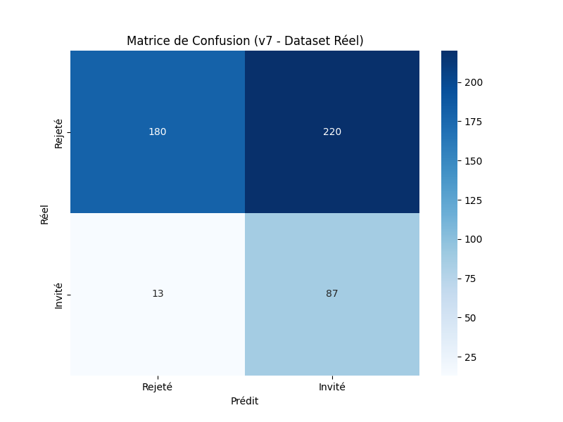
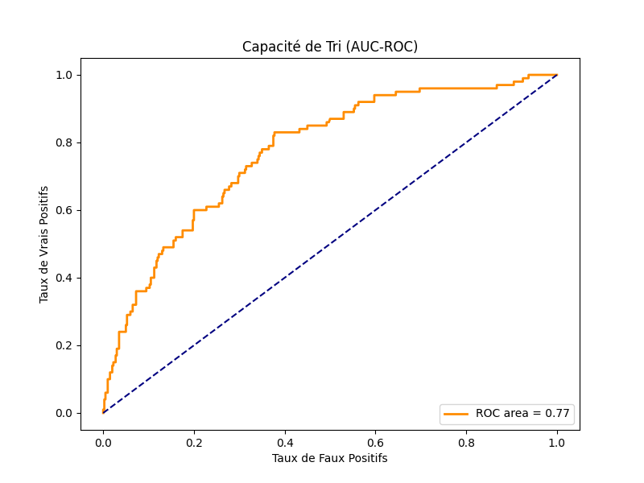
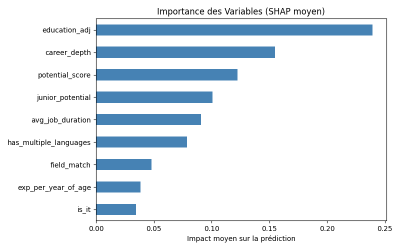
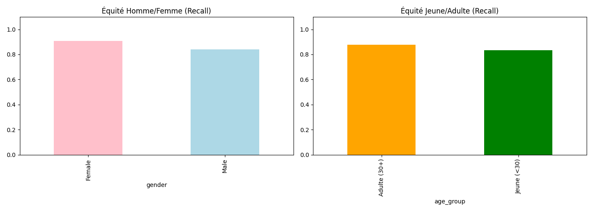
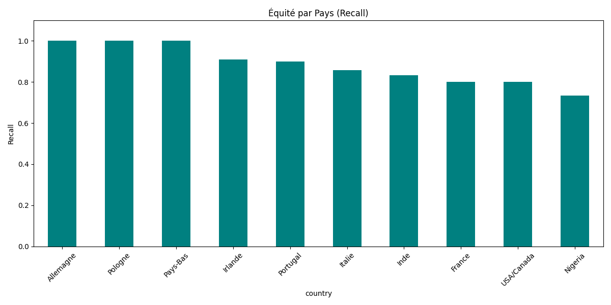

# Rapport de Projet : CV Screening

**Candidats :** Tom Perez Le Tiec | Arnaud Leroy
**Date :** 20 Avril 2026 — **Mise à jour : 10 Juin 2026 (modèle v7)**

---

## Contexte & Objectif

CV-Intelligence est un système de **pré-filtrage automatique** de candidatures — l'équivalent d'un filtre anti-spam avant l'intervention du RH. À l'échelle d'une grande entreprise (250 000 candidatures/mois chez Google), un tri manuel est impossible. L'objectif n'est pas de classer finement les candidats, mais d'éliminer les candidatures hors-sujet pour que le RH ne traite que les profils pertinents.

**Conséquence directe sur les métriques :** on optimise le **recall** (ne pas rater un bon candidat) plus que la précision (ne pas sur-inviter). Un faux négatif est une perte définitive ; un faux positif est géré par le RH en quelques secondes.

---

## Architecture Technique

### Pipeline ML (`pipeline_ml/core/`, orchestré par `pipeline_ml/run.py`)

```
p00_exploration.py → Exploration des données brutes (data/raw/)
p01_parse.py        → Parsing des 500 CVs (.txt/.pdf/.docx, regex + LLM Groq)
                       → features.csv + identities.csv
p02_features.py     → Feature engineering v2 (features composites)
p03_analysis.py     → EDA : outliers, VIF, mutual information
p04_train.py        → Entraînement Grid Search + seuils différenciés → model.pkl
p05_label_audit.py  → Audit statistique des biais dans les labels (genre/âge/pays)
p06_audit.py        → Audit équité (genre, âge, pays) + SHAP, tracking MLflow
p07_labeling.py     → Outil de labellisation manuelle
```

Le tout est tracé dans **MLflow** (`mlruns/`, run actif : `2ee2303cac5740ffbf0729baf1346296`,
expérience `cv-intelligence`) — chaque ré-entraînement loggue hyperparamètres, seuils,
métriques et artefacts (`evaluation.txt`, `audit.txt`).

### Modèle

`LogisticRegression` optimisée par `GridSearchCV` (5-fold stratifié, scoring AUC-ROC) sur
`C ∈ {0.01, 0.05, 0.1, 0.5, 1.0, 5.0}` et `l1_ratio ∈ {0, 0.5, 1}` (solver `saga`,
`class_weight='balanced'` pour le déséquilibre 80% rejetés / 20% invités).

**Meilleurs hyperparamètres (v7) :** `C=0.01`, `l1_ratio=0.0` (régularisation L2/Ridge forte),
`solver=saga`, `class_weight=balanced`.

Le choix d'une régression logistique (plutôt qu'un modèle d'ensemble) répond à trois
contraintes du projet : explicabilité SHAP exacte (`LinearExplainer`), conformité AI Act
(système RH classé haut risque, Annexe III), et stabilité sur un dataset de taille modeste
(500 CV).

---

## Feature Engineering v2

### Variables du modèle (9 variables)

| Variable | Description | SHAP (importance) | Pourquoi |
|---|---|---|---|
| `education_adj` | Niveau de diplôme, échelle compressée (Bachelor=0.30, Master=0.70) | **0.2392 (26.3%)** | Critère de sélection le plus stable, biais académique atténué vs `education_level` brut |
| `career_depth` | Expérience × durée moyenne | 0.1550 (17.1%) | Profondeur de carrière |
| `potential_score` | (Skills + Méthodes + Certif) / (Exp+1) | 0.1223 (13.5%) | Valorise les profils à fort potentiel |
| `junior_potential` | `is_junior × potential_score` | 0.1007 (11.1%) | Booste les juniors à fort potentiel sans utiliser l'âge directement |
| `avg_job_duration` | Durée moyenne par poste | 0.0908 (10.0%) | Stabilité de carrière |
| `has_multiple_languages` | 1 si ≥ 2 langues | 0.0788 (8.7%) | Signal de profil international, légèrement favorable aux femmes |
| `field_match` | Formation cohérente avec le secteur visé | 0.0479 (5.3%) | Pertinence de la candidature |
| `exp_per_year_of_age` | `years_experience / max(age-22, 1)` | 0.0385 (4.2%) | Exp. normalisée — corrige le biais de genre (carrières fragmentées) |
| `is_it` | 1 si secteur Informatique | 0.0347 (3.8%) | Secteur dominant dans le dataset |

> Aucun attribut protégé (genre, âge, pays) n'est utilisé comme feature du modèle.
> L'âge sert uniquement en post-traitement pour sélectionner le seuil de décision.

### Évolution v1 → v2

La principale évolution est le **remplacement de `years_experience` par `exp_per_year_of_age`**
et de `education_level` par `education_adj`.

| Problème v1 | Solution v2 |
|---|---|
| `years_experience` : SHAP #1 (0.52), structurellement défavorable aux femmes (pauses carrière) et aux juniors | `exp_per_year_of_age = years_experience / max(age-22, 1)` normalise par la durée de carrière *possible* |
| `education_level` brut : SHAP #1 (0.529), biais académique fort (Master 30.1% vs Bachelor 12.7% d'invitation) | `education_adj` compresse l'échelle (Bachelor=0.30, Master=0.70) — biais atténué mais reste la feature dominante |
| `is_finance` : colinéaire avec `is_it` | Supprimée |
| `potential_per_year` (testée puis retirée) : inversement corrélée aux labels (sénior = score faible), interaction négative avec le recall féminin | Non retenue dans `V2_FEATURES` |

---

## Seuils Différenciés par Âge — v7 (Parité Démographique)

Le modèle applique deux seuils de décision pour ne pas pénaliser les jeunes candidats,
qui ont mécaniquement moins d'années de carrière.

| Version | Seuil adulte (30+) | Seuil junior (<30) | Méthode |
|---|---|---|---|
| v6 | 0.460 | 0.474 (junior plus strict ❌) | `recall ≥ 0.55` — maximise la précision parmi les seuils atteignant ce recall |
| **v7** | **0.460** (F1-optimal) | **0.326** (junior plus permissif ✅) | **Parité démographique** (Feldman et al., 2015) |

**Pourquoi ce changement :** le seuil junior v6 (0.474 > 0.460) pénalisait *davantage*
les juniors que les adultes — l'inverse de l'intention. De plus, calibrer un seuil sur
les labels juniors est invalide car `p05_label_audit` confirme un biais d'âge significatif
dans les labels (p<0.0001). Le seuil junior v7 est donc **calculé automatiquement à chaque
ré-entraînement** : c'est le score minimal tel que le taux d'invitation des juniors égale
le taux d'invitation observé chez les adultes (62.3% sur train) — sans dépendre des
labels juniors biaisés.

Détail complet de la justification : [`docs/audit/audit_comparatif_v6_v7.md`](../docs/audit/audit_comparatif_v6_v7.md).

---

## Métriques de Performance — v7

### Sur le jeu de test isolé (20%, MLflow)

| Métrique | v2 (Avril, full dataset) | **v7 (Juin, test set)** |
|---|---|---|
| ROC-AUC | 0.797 | **0.837** |
| Recall global (Invités) | — | **0.90** |
| Accuracy | 0.70 | 0.59 |
| F1-Score (Invité) | 0.53 | 0.47 |
| Precision (Invité) | — | 0.32 |

> La baisse d'accuracy/F1 entre v2 et v7 n'est **pas une régression du modèle** (l'AUC
> progresse) : c'est le **coût assumé de la correction de fairness** (seuil junior
> beaucoup plus permissif → davantage d'invitations, donc plus de faux positifs). Détail
> du trade-off : [`docs/audit/audit_comparatif_v6_v7.md`](../docs/audit/audit_comparatif_v6_v7.md).

### Sur le dataset complet (500 CV, modèle déployé — illustratif)

| Métrique | Valeur |
|---|---|
| Recall global (Invités) | 0.87 |
| Accuracy | 0.53 |
| F1-Score (Invité) | 0.43 |

> Ces chiffres sont calculés en ré-appliquant le modèle déployé aux 500 CV (in-sample,
> donc optimistes sur le recall) — ils servent à produire les graphiques ci-dessous sur
> l'ensemble du dataset. Les métriques de référence pour évaluer la généralisation sont
> celles du jeu de test ci-dessus.

### Matrice de Confusion (500 CV, modèle v7)

|  | Prédit Rejeté | Prédit Invité |
|---|---|---|
| **Réel Rejeté** | 180 (VN) | 220 (FP) |
| **Réel Invité** | 13 (FN) | 87 (VP) |



### Courbe ROC



---

## Importance des Variables (SHAP) — v7



Voir le tableau détaillé dans la section [Feature Engineering v2](#feature-engineering-v2)
ci-dessus. `education_adj` reste la feature la plus influente (26.3%) — le biais
académique est atténué mais pas éliminé, c'est la limite la plus difficile à corriger
sans relabeling humain.

---

## Audit d'Équité (v7)

### Par Genre

| Groupe | n | Recall | Précision |
|---|---|---|---|
| Femmes | 233 | **0.909** | 0.274 |
| Hommes | 267 | **0.839** | 0.292 |
| **Écart** | — | **−7.0 pts (F>H)** | — |

Le recall progresse pour les deux genres par rapport à v6 (Femmes 0.818→0.909, Hommes
0.821→0.839). L'écart résiduel (−7.0pp) provient du taux d'invitation historique
légèrement plus bas pour les femmes adultes (23.8% vs 26.0% hommes), qui se traduit
par un seuil junior proportionnellement plus favorable aux femmes — pas d'une feature
biaisée. Reste dans la zone acceptable (≤10pp).



### Par Âge

| Groupe | n | Recall v6 | **Recall v7** |
|---|---|---|---|
| Adulte (30-45) | 326 | 0.878 | **0.878** (inchangé) |
| Junior (<30) | 174 | 0.556 | **0.833** (+27.7pp) |
| **Écart Adulte−Junior** | — | 32.2pp | **4.5pp (−86%)** |

**Trade-off documenté :** la précision junior chute de 30.3% à 13.6% — davantage de
juniors invités ne seront pas retenus en entretien. Coût accepté car (1) les "faux
positifs" juniors sont potentiellement de bons candidats historiquement rejetés par un
biais humain documenté, et (2) le système ne fait que pré-filtrer, l'entretien humain
reste la décision finale (AI Act Art. 14).

> ⚠️ **Aucun profil Senior (>45 ans) dans le dataset** — le modèle n'a jamais été
> entraîné ni évalué sur ce segment. Toute décision automatisée sur des seniors doit
> être revue manuellement.

### Par Pays

| Pays | n | Recall |
|---|---|---|
| Allemagne | 34 | 1.000 |
| Pologne | 49 | 1.000 |
| Portugal | 39 | 1.000 |
| Italie | 46 | 0.900 |
| Inde | 42 | 0.900 |
| USA | 114 | 0.857 |
| Pays-Bas | 47 | 0.846 |
| France | 51 | 0.833 |
| Nigeria | 42 | 0.800 |
| Irlande | 36 | 0.667 |

Le modèle ne voit pas le pays directement (proxy bias via `career_depth` /
`avg_job_duration`, France et Portugal ayant des `career_depth` hors-norme). Aucun
biais géographique statistiquement significatif dans les labels (tous p>0.10), mais
les effectifs (34-114 par pays) sont **sous-puissants** pour le prouver ou l'infirmer
— limitation ouverte, surveillance active. Détail :
[`docs/audit/audit_comparatif_v6_v7.md`](../docs/audit/audit_comparatif_v6_v7.md) §3.



---

## Conclusion

Le modèle v7 (AUC=0.837, 500 CV) remplit son rôle de **pré-filtrage anti-spam** avec un
recall élevé (0.87 global, 0.83-0.91 par sous-groupe genre/âge) et une réduction
majeure des écarts de fairness par rapport aux versions précédentes.

### Apports v7 vs versions précédentes

| Axe | v2 | v6 | **v7** |
|---|---|---|---|
| AUC (test) | 0.785 | 0.837 | **0.837** |
| Écart genre (recall) | 13 pts | 0.3 pt | **−7.0 pts** (zone acceptable) |
| Écart âge (recall) | — | 32.2 pts | **4.5 pts (−86%)** |
| Méthode seuil junior | seuil unique | recall≥0.55 (❌ contre-intuitif) | **parité démographique** (auto-calculé) |

### Limites restantes (assumées et documentées)

- **Absence de profils Senior (>45)** dans les données d'entraînement — segment non couvert.
- **Biais académique résiduel** : `education_adj` reste la feature dominante (26.3% SHAP).
- **Biais géographique non résolu** : effectifs insuffisants par pays (34-114) pour
  conclure ou corriger statistiquement.
- **Précision "Invité" faible (0.32 sur test)** : coût assumé du pré-filtrage à haute
  sensibilité — le RH reste l'arbitre final.
- **Seuil junior dynamique** : recalculé à chaque ré-entraînement, doit être monitoré
  via MLflow.
- **Dataset synthétique** (500 CV générés) : certaines features anti-spam réelles
  (`cv_completeness`, `red_flag_count`) non pertinentes ici.

### Pour aller plus loin

| Document | Contenu |
|---|---|
| [`docs/audit/audit_comparatif_v6_v7.md`](../docs/audit/audit_comparatif_v6_v7.md) | Analyse complète des biais (genre/âge/pays), justification v6→v7, métriques test set |
| [`docs/audit/documentation_technique_ai_act.md`](../docs/audit/documentation_technique_ai_act.md) | Conformité EU AI Act, architecture, explicabilité SHAP |
| [`models/HISTORY.md`](../models/HISTORY.md) | Historique complet des versions du modèle (v1→v7) |
| [`docs/project/mlops_and_ocr_roadmap.md`](../docs/project/mlops_and_ocr_roadmap.md) | Roadmap MLOps (MLflow, OCR, DVC) |
